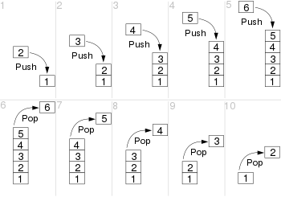
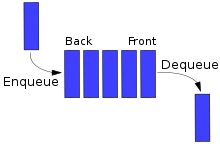

# Python Stack and Queue difference

A queue and a stack are both abstract data types (ADTs) that are used in computer science to store and manage collections of elements, but they differ in how elements are inserted and removed:

### Stack:
- **LIFO**: Stack is a Last In First Out (LIFO) structure. This means that the last element added to the stack will be the first one to be removed.
- **Operations**:
  - **Push**: Add an element to the top of the stack.
  - **Pop**: Remove the element from the top of the stack.
- **Use Cases**: Undo mechanisms in text editors, call stack in programming languages, parsing expressions in compilers, etc.
- **Example**: Consider a stack of plates; you can only take the top plate off the stack, and when adding more plates, you place them on the top of the stack.

### Queue:
- **FIFO**: Queue is a First In First Out (FIFO) structure. This means that the first element added to the queue will be the first one to be removed.
- **Operations**:
  - **Enqueue**: Add an element to the end of the queue.
  - **Dequeue**: Remove the element from the front of the queue.
- **Use Cases**: Print queues, task scheduling, breadth-first search in graphs, serving requests on a single shared resource like a printer, etc.
- **Example**: Consider a line of people at a ticket counter; the first person in the line is the first to get served and leave the line.

### Summary of Differences:

| Aspect     | Stack          | Queue          |
|------------|----------------|----------------|
| Order      | LIFO           | FIFO           |
| Addition   | Push to top    | Enqueue to end |
| Removal    | Pop from top   | Dequeue from front |
| Real-World Analogy | Stack of plates | Line of people |

In programming, stacks and queues can be implemented using arrays or linked lists, and languages often provide library support for these data structures, like the `stack` and `queue` in C++ STL, or `deque` in Python's `collections` module which can be used as both a stack and a queue.